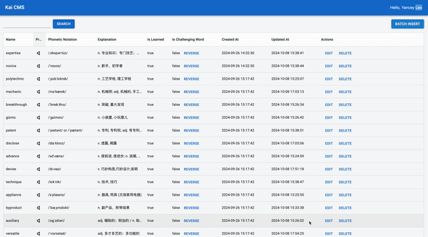

# Kai(甲斐) Monorepo

[](https://github.com/YanceyOfficial/kai-monorepo/actions/workflows/github-actions-kai-cms.yml)
[](https://github.com/YanceyOfficial/kai-monorepo/actions/workflows/github-actions-kai-backend.yml)
[](https://opensource.org/licenses/MIT)
[](https://prettier.io/)
[](https://github.com/YanceyOfficial/kai-monorepo/pulls)
[](https://nodejs.org/en/)
[](https://twitter/YanceyOfficial)

Flashcards using AI for learning words. This is the repository for the CMS and backend.



## Available Scripts

- To start CMS development server, you can execute `npm run dev` under the `apps/cms` folder.
- To start Backend development server, you can execute `npm run start:dev` under the `apps/backend` folder.

## Environment Variables

### CMS

```dash
PORT=3001

VITE_SERVICE_URL=<YOUR_VITE_SERVICE_URL>
VITE_KEY_CLOAK_CLIENT_ID=<YOUR_VITE_KEY_CLOAK_CLIENT_ID>
VITE_KEY_CLOAK_REALM=<YOUR_VITE_KEY_CLOAK_REALM>
VITE_KEY_CLOAK_URL=<YOUR_VITE_KEY_CLOAK_URL>
```

### Backend

```dash
APP_PORT=2998
NODE_ENV=development

OPENAI_KEY=<YOUR_OPENAI_KEY>

DATABASE_HOST=<YOUR_DATABASE_HOST>
DATABASE_PORT=<YOUR_DATABASE_PORT>
DATABASE_USER=<YOUR_DATABASE_USER>
DATABASE_PWD=<YOUR_DATABASE_PWD>
DATABASE_COLLECTION=<YOUR_DATABASE_COLLECTION>

KEY_CLOAK_URL=<YOUR_KEY_CLOAK_URL>
KEY_CLOAK_REALM=<YOUR_KEY_CLOAK_REALM>
KEY_CLOAK_CLIENT_ID=<YOUR_KEY_CLOAK_CLIENT_ID>
KEY_CLOAK_CLIENT_SECRET=<YOUR_KEY_CLOAK_CLIENT_SECRET>
```

## Contributing

The main purpose of this repository is to continue to evolve Kai Monorepo, making it faster and easier to use. Development of Kai Monorepo happens in the open on GitHub, and we are grateful to the community for contributing bugfixes and improvements. Read below to learn how you can take part in improving Kai Monorepo.

### [Code of Conduct](./CODE_OF_CONDUCT.md)

Kai Monorepo has adopted a Code of Conduct that we expect project participants to adhere to. Please read [the full text](./CODE_OF_CONDUCT.md) so that you can understand what actions will and will not be tolerated.

### [Contributing Guide](./CONTRIBUTING.md)

Read our [contributing guide](./CONTRIBUTING.md) to learn about our development process, how to propose bugfixes and improvements, and how to build and test your changes to Kai Monorepo.

### Good Issues

Please make sure to read the [Issue Reporting Checklist](./.github/ISSUE_TEMPLATE/bug_report.md) before opening an issue. Issues not conforming to the guidelines may be closed immediately.

## License

Kai Monorepo is licensed under the terms of the [MIT licensed](https://opensource.org/licenses/MIT).
